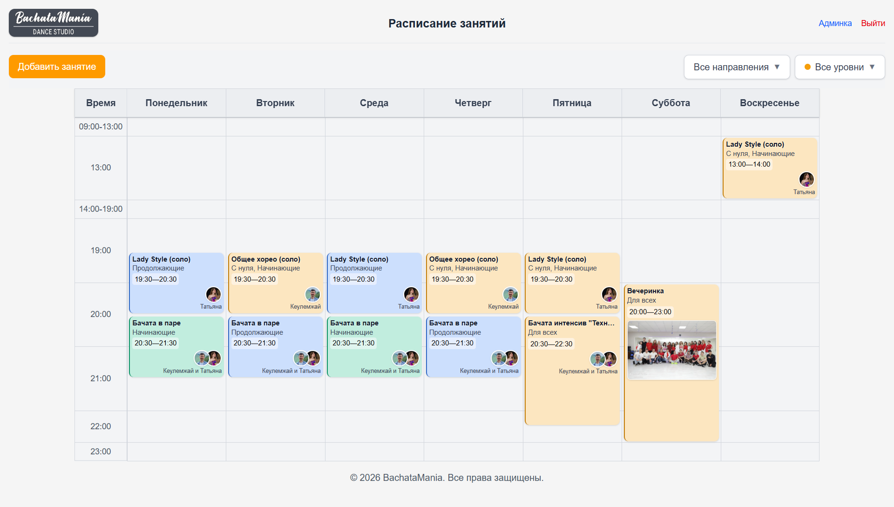
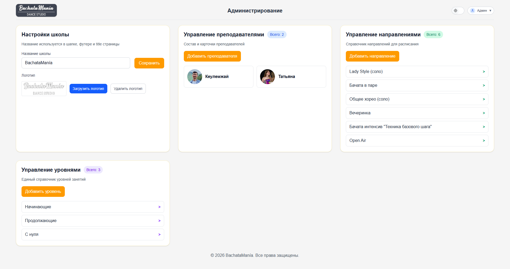

# dance-studio

[](https://github.com/baikhonov/dance-studio/actions/workflows/ci.yml)
[](https://github.com/baikhonov/dance-studio/actions/workflows/deploy.yml)

Portfolio project for a dance studio website with a public class schedule and an admin panel for content management.

The app includes:
- public timetable view for students
- JWT-based admin authentication
- lesson CRUD (directions, levels, teachers, schedule)
- image uploads for teacher photos and lesson posters
- production deployment with Docker Compose, PostgreSQL, and HTTPS (Caddy)

Tech stack:
- frontend: Vue 3 + Vite
- backend: Node.js + Express + Drizzle ORM
- database: PostgreSQL

## CI/CD

- CI: runs on each push/PR and validates frontend build + frontend type-check + backend type-check.
- CD: deploys to VPS via GitHub Actions over SSH (Docker Compose rebuild + restart).
- Production host: [https://dance-studio-portfolio.ru/](https://dance-studio-portfolio.ru/)

## Live demo

[https://dance-studio-portfolio.ru/](https://dance-studio-portfolio.ru/)

## Screenshots

### Public schedule



### Admin panel



## Recommended IDE Setup

[VS Code](https://code.visualstudio.com/) + [Vue (Official)](https://marketplace.visualstudio.com/items?itemName=Vue.volar) (and disable Vetur).

## Recommended Browser Setup

- Chromium-based browsers (Chrome, Edge, Brave, etc.):
  - [Vue.js devtools](https://chromewebstore.google.com/detail/vuejs-devtools/nhdogjmejiglipccpnnnanhbledajbpd)
  - [Turn on Custom Object Formatter in Chrome DevTools](http://bit.ly/object-formatters)
- Firefox:
  - [Vue.js devtools](https://addons.mozilla.org/en-US/firefox/addon/vue-js-devtools/)
  - [Turn on Custom Object Formatter in Firefox DevTools](https://fxdx.dev/firefox-devtools-custom-object-formatters/)

## Customize configuration

See [Vite Configuration Reference](https://vite.dev/config/).

## Project Setup

```sh
npm install
```

### Compile and Hot-Reload for Development

```sh
npm run dev
```

### Compile and Minify for Production

```sh
npm run build
```

### Lint with [ESLint](https://eslint.org/)

```sh
npm run lint
```

## Docker workflow (learn + production)

### Local learning setup (backend + postgres)

1) Start services:

```sh
docker compose up -d
```

2) Apply schema and check health:

```sh
docker compose logs -f backend
curl http://localhost:3000/health
```

3) (Optional) Seed demo data:

```sh
cd server
npm run db:seed
```

### VPS production deploy (Docker Compose + HTTPS)

1) Copy project to VPS and set env:

```sh
cp .env.production.example .env.production
```

Fill values in `.env.production` (`DOMAIN`, DB creds, JWT secret).

2) Start production stack:

```sh
docker compose --env-file .env.production -f docker-compose.prod.yml up -d --build
```

Services:
- `postgres` with persistent volume
- `backend` (migrations on startup)
- `frontend` (Vite build served by Nginx)
- `caddy` (automatic HTTPS + reverse proxy)

3) Verify:
- `https://<DOMAIN>/` opens frontend
- `https://<DOMAIN>/health` is available via backend
- admin login, CRUD, and uploads work

### Backup and restore (PostgreSQL)

Backup:

```sh
docker compose --env-file .env.production -f docker-compose.prod.yml exec -T postgres pg_dump -U "$POSTGRES_USER" "$POSTGRES_DB" > backup_$(date +%F).sql
```

Restore:

```sh
docker compose --env-file .env.production -f docker-compose.prod.yml exec -T postgres psql -U "$POSTGRES_USER" -d "$POSTGRES_DB" < backup.sql
```

Rollback (app only):

```sh
docker compose --env-file .env.production -f docker-compose.prod.yml down
git checkout <previous-stable-tag-or-commit>
docker compose --env-file .env.production -f docker-compose.prod.yml up -d --build
```
